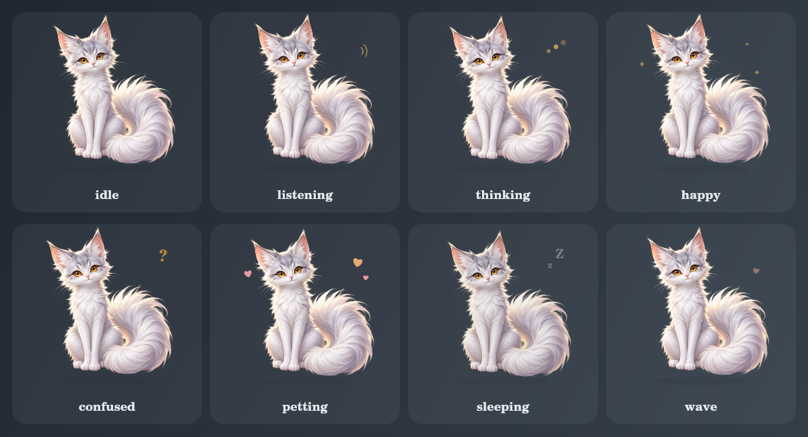

# 糯叽桌宠 Nuoji Pet

一只住在 SillyTavern 页面里的银白猫狐。糯叽会听你说话、陪模型思考、迎接新回复，也可以被拖到屏幕上任意位置——但我们不把她喂成可露丽那么胖。

这是 GPT × Ripple 一起搓、经 Fable51 工程审校的会眨眼、会甩尾版 `v0.4.0`。



## 现在会什么

- 悬浮在 SillyTavern 页面上，猫身可摸可拖、透明区域可以点穿
- 鼠标和手机触摸都能拖动，位置会保存
- 点一下或按 Enter / 空格可以摸摸糯叽
- 日常会自然呼吸并约每 4.7 秒眨一次眼
- 原定妆图分层后，尾巴会按心情轻摆、快甩或困倦地慢慢晃
- 开心、被摸摸和睡觉时会切换真正绘制的闭眼眼周皮肤；眼皮线保留，灰黑眼圈已清干净
- 根据酒馆事件自动切换动作：
  - 发出用户消息：先竖起耳朵听你说
  - 开始生成：思考
  - 流式输出：常驻“让我想想…”并轻轻点头
  - 完整回复渲染完成：开心
  - 停止或异常结束：迷糊
  - 切换聊天：挥爪跟上
- 设置面板可调整显示、大小、透明度、气泡和动态效果
- 展开糯叽自己的设置时，她会临时显示在移动端抽屉上方，方便实时预览
- 设置按钮不会再被窄按钮主题挤成竖排文字
- 适配 iPhone 安全视口、触摸拖动和屏幕旋转
- 关闭显示后会暂停 Canvas 动画，扩展停用或热重载时会完整清理监听
- 正式生成事件开始后才进入思考，并忽略其他扩展触发的 `quiet` / `dryRun` 后台生成
- 同时兼容流式与非流式的不同事件顺序，回信、停止和异常结束都会正确收尾
- 设置面板显示最近一次联动状态，手机上无需控制台也能判断有没有收到发送信号
- 不调用模型、不发送聊天内容、不额外消耗 token

`v0.2.0` 换上透明 2.5D 银白猫狐皮肤；`v0.3.x` 陆续加入眨眼、点击穿透、手机减负与可靠的流式生命周期；`v0.4.0` 在稳定联动之上把原画拆层，让尾巴真正按心情摆动。Canvas 继续负责呼吸、倾头、跳跃与状态特效。旧造型只在皮肤文件意外加载失败时应急出现。

## 本地安装测试

1. 解压下载包。
2. 确认目录结构是 `nuoji-pet/manifest.json`，不要多套一层同名文件夹。
3. 把整个 `nuoji-pet` 文件夹放进：

   ```text
   SillyTavern/data/<你的用户目录>/extensions/
   ```

4. 重启 SillyTavern，或刷新酒馆页面。
5. 打开“扩展”设置，展开“糯叽桌宠”即可调大小、透明度和预览动作。

等仓库发布到 GitHub 后，也可以在 SillyTavern 的“安装扩展”里直接粘贴仓库地址安装和更新。

## 操作

- 点糯叽：摸摸她
- 拖糯叽：换位置，松手后自动保存
- 键盘选中糯叽后按 Enter / 空格：摸摸她
- 设置 → 扩展 → 糯叽桌宠：预览八种状态或重置位置

## 给其他扩展联动

页面内可以发一个自定义事件让糯叽做动作：

```js
window.dispatchEvent(new CustomEvent('nuoji:react', {
    detail: {
        state: 'happy',
        message: '找到啦！',
        duration: 1800,
    },
}));
```

也可以使用简写：

```js
window.NuojiPet.react('sleeping', '困嘟嘟…', 3000);
```

可用状态：`idle`、`listening`、`thinking`、`happy`、`confused`、`petting`、`sleeping`、`wave`。

## 文件

- `manifest.json`：SillyTavern 扩展清单
- `CHANGELOG.md`：版本更新记录
- `index.js`：事件、拖动、设置与状态机
- `pet-renderer.js`：2.5D 皮肤播放器、状态动画与应急绘制
- `assets/nuoji-base-v1.png`：糯叽透明主皮肤
- `assets/nuoji-body-v1.png` / `nuoji-tail-v1.png`：保持原画像素的身体与尾巴层
- `assets/nuoji-underpaint-v1.png`：只在尾巴摆开时露出的隐藏补毛层
- `assets/nuoji-closed-eyes-v2.png`：去掉灰黑眼圈的闭眼眼周透明小皮肤
- `style.css`：悬浮层、手机适配和设置面板样式
- `settings.html`：酒馆扩展设置界面
- `preview.html`：不启动酒馆也能检查动作的本地预览页

## 性能与隐私

- Canvas 聊天页最多约 24 FPS；糯叽设置展开时自动降为约 12 FPS，开启“减少动态效果”后进一步降频
- 高 DPR 设备的画布最大为 750 × 750，并避开逐帧 CSS 滤镜合成
- 页面切到后台时停止实际绘制
- 流式 token 事件只触发轻微视觉脉冲，不读取 token 文本
- 没有网络请求、追踪、遥测或第三方依赖

流式生命周期的兼容判断参考了 [Sanj333 的公开打字指示器](https://gitee.com/Sanj333/SillyTavern-TypingIndicatorThemes) 所验证的事件顺序；糯叽保持轻量、独立实现。

## 下一步想搓的

- 耳朵分层：听你说时竖起，迷糊时一只软软耷下
- 摸摸值、好感度和小鱼干，但控制体重
- 白天、夜晚和长时间陪伴动作
- 糯叽自己的小窝与配饰

## License

[MIT](LICENSE)
